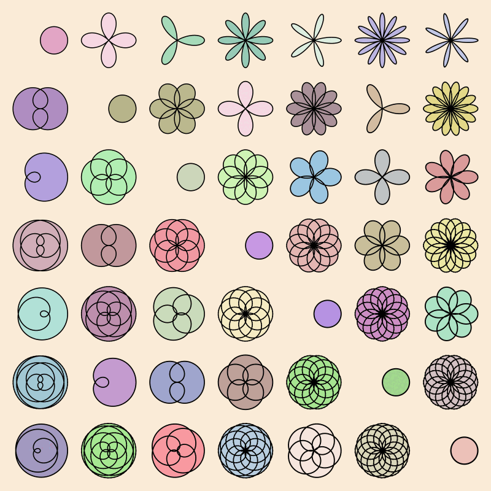

# generative-art

trying out generative art with `Luxor.jl` (`julia`). i did some of the exploring in `Pluto` notebook, which adds some really nice interactivity.

## february - playing with lines

*in progress*

this time i want to explore the simple idea of putting angled lines at regular grid points - and experimenting with placement (order, jitter), how properties change between elements (line thickness, hue, angle), possibly following `perlin` noise or a version of random walk.

<figure>

<caption>my initial sketch...</caption>
<figure>

## (end of) january - mathematical roses

- using `Luxor.jl` to create the table of rose plots on the wikipedia page. I think this looks really beautiful.

<figure>

<caption>SVG figure from wikipedia</caption>
<figure>

The classic forms of those curves are basically `cos()` plots in polar coordinates at different frequencies and to make things a bit easier for plotting - transformed into cartesian coordinates.

<figure>

<caption>normal, pointy and edgy versions of `rose`</caption>
<figure>

If you use a `sawtooth` or `triangularwave` waveform, the shapes become a bit more unusual.

## december - snowflakes

my first idea was to use a direct drawing style (using lines and transforms), but I quickly discovered that using turtle graphics is a much more natural fit.

have a look at the code to see. i may add some details and mods here

## build a single snowflake

- 6 turtles, spaced at 60º, $\frac{\pi}{6}, moving out from centre with randomised step lengths and simple 0.5 probability of putting either a hexagon or a circle.

## a hex grid of snowflakes

using `Luxor.jl` `HexGrid()` generator, which supplies center coordinates for points on a hex grid (neat!)

