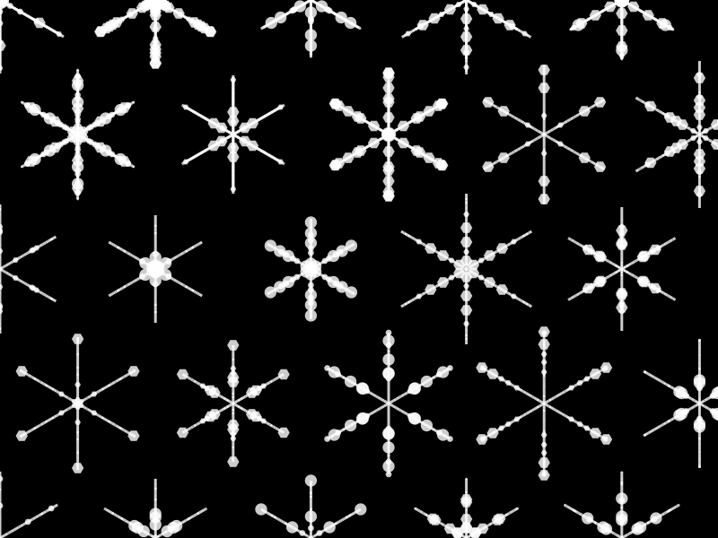

# generative-art

trying out generative art with `Luxor.jl` (`julia`). i did some of the exploring in `Pluto` notebook, which adds some really nice interactivity.

## snowflakes

my first idea was to use a direct drawing style (using lines and transforms), but I quickly discovered that using turtle graphics is a much more natural fit.

have a look at the code to see. i may add some details and mods here

