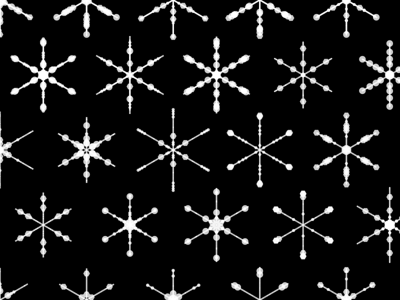

# generative-art

trying out generative art with `Luxor.jl` (`julia`). i did some of the exploring in `Pluto` notebook, which adds some really nice interactivity.

## snowflakes

my first idea was to use a direct drawing style (using lines and transforms), but I quickly discovered that using turtle graphics is a much more natural fit.

have a look at the code to see. i may add some details and mods here

## build a single snowflake

- 6 turtles, spaced at 60º, $\frac{\pi}{6}, moving out from centre with randomised step lengths and simple 0.5 probability of putting either a hexagon or a circle.

## a hex grid of snowflakes

using `Luxor.jl` `HexGrid()` generator, which supplies center coordinates for points on a hex grid (neat!)

